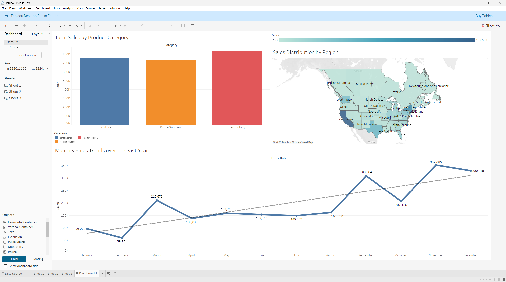

1. Import the excel file in Tableau.
2. Each visualization must be done in a new sheet. Navigate to Sheet 1 using the Sheet Pane.
3. Create Visualizations:

   a. A bar chart showing total sales by product category.

   - Name the sheet appropriately by clicking on the Sheet Name and editing the same.
   - Drag the **Category** column from the **Data Columns** to the **Column Shelf**.
   - Drag the **Sales** column from the **Data Columns** to the **Row Shelf**.
   - In the **Marks Pane**, click on the dropdown and choose **Bar** as the Mark type.
   - You may also drag **Category** to the **Color Tab** in the **Marks Pane** to assign different colors to categories.

   b. A line chart showing monthly sales trends.

   - Add a new **Sheet** in the **Sheet Pane**
   - Name the sheet appropriately.
   - Drag **Order Date** from the **Data Columns** to the **Column Shelf**. Click on **Order Date** to reveal a dropdown, and choose the Month option to chart by Month.
   - Drag **Sales** from the **Data Columns** to the **Row Shelf**.
   - Since the data consists of sales only from the year 2020, filtering by year is unnecessary.
   - Drag **Sales** to the **Label Tab** within the **Marks Pane** to get a labelled Line Chart visualization.
   - Feel free to play with and tweak the thicknesses and colors of the Trend Line and the Line plot.

   c. A geographic map showing sales distribution by State/Province.

   - Add a new **Sheet** in the **Sheet Pane**
   - Name the sheet appropriately.
   - Add State/Province from Data Columns to the Column shelf.
   - Click on the **Show Me** dropdown on the Top Right, and choose the Map Option (the Fifth one). A map will appear on your sheet once you do this.
   - On the bottom-left corner of the Map, you might see, for instance, an indication like “10 unknown”. Click on it, and choose **Edit Locations** in the dialog that appears.
   - Choose the option **From Field** and set the field to **Country/Region**. This will sort out all unknowns and add them to your map. Click OK.
   - Now, drag **Sales** from the Data Columns to the **Color Tab** inside the **Marks Pane**. This will create a choropleth map of the Sales Data.
   - Now, drag **State/Province** from **Data Columns** to the **Label Tab** in the **Marks Pane**.
   - This will label the States/Provinces on the map.

4. Create a Dashboard from the Sheet Pane and drag and drop all the Sheets into the Dashboard in any preferred layout.

