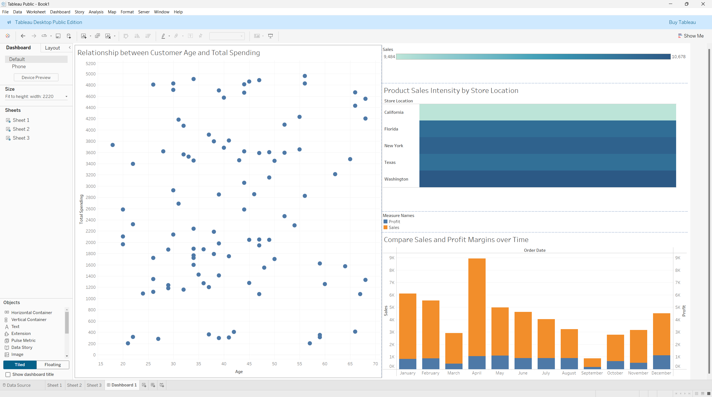

1. Import the excel file in Tableau.
2. Navigate to Sheet 1 using the Sheet Pane.
3. Create Visualizations:

   a. A scatter plot showing the relationship between customer age and total spending.

   - Name the sheet appropriately
   - Drag **Age** to the **Column Shelf** from the **Data Columns**.
   - Right-click on the **Age** Column in the **Column Shelf**, and choose the option that says **Dimension**.
   - Drag **Total Spending** from the **Data columns** to the **Row Shel**f.
   - Right-click on the **Total Spending** Column in the **Row Shelf**, and choose the option that says **Dimension**.
   - In the **Marks Pane**, change the **Mark Type** from **Automatic to Circle**.
   - You may tweak the Sizes and Colors in the Scatter plot.

   b. A heat map illustrating product sales intensity by store location.

   - Create a new **Sheet** in the **Sheet Pane**.
   - Name the Sheet Appropriately.
   - Drag **Store Location** from the **Data Columns** to the **Row Shelf**.
   - Drag **Sales** to the **Color Tab** in the **Marks Pane** to form a Heatmap Chart.
   - You may manipulate the sizes for a better view.

   c. A dual-axis chart comparing sales and profit margins over time.

   - Create a new **Sheet** in the **Sheet Pane**.
   - Name the Sheet Appropriately.
   - Drag **Sales** and **Profit** from **Data Columns** to the **Row Shelf**. Right-click on any one of the columns (Sales or Profit), and choose the option **Dual Axis** to combine the two metrics into one chart.
   - Now Drag **Order Date** from the **Data Columns** to the **Column Shelf**. Right-click on the **Order Date** in the **Column Shelf**, and choose **Month** instead of **Year** in the options.
   - Right-click on the **Right Vertical axis** in the chart, and choose **Synchronize Axis**.
   - If you aren’t seeing a Bar Chart, go to the **Marks Pane** and choose the **Mark Type** as **Bar** instead of **Automatic**.

4. Create a Dashboard from the Sheet Pane and drag and drop all the Sheets into the Dashboard in any preferred layout.

