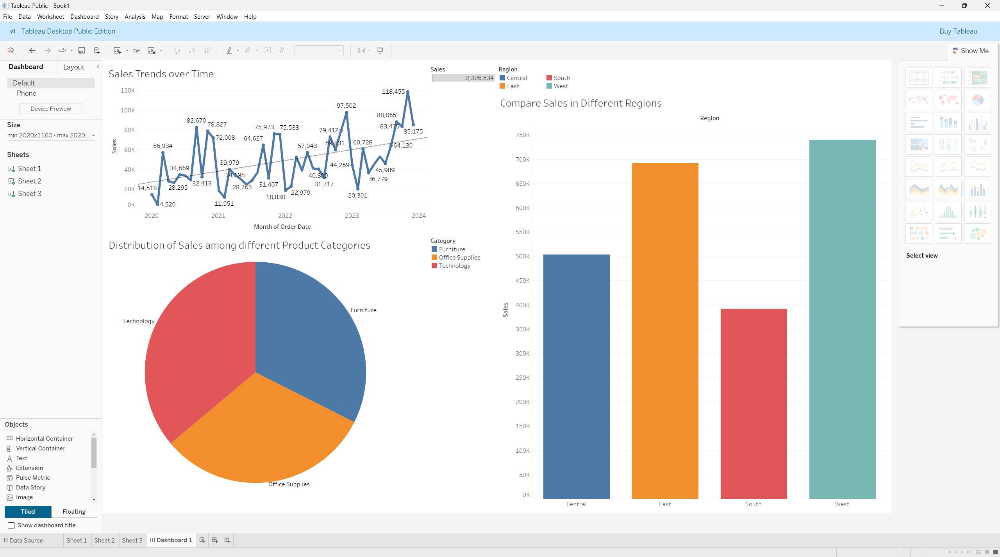

1. Import the excel file in Tableau.
2. Navigate to Sheet 1 using the Sheet Pane.
3. Create Visualization:
   a. Create a line chart to show sales trends over time.

   - Name the Sheet appropriately.
   - Drag **Sales** from the **Data Columns** to the **Row Shelf**.
   - Drag **Order Date** from the **Data Columns** to the **Column Shelf**. Right-click the **Order Date** on the **Column Shelf** and choose **Month** instead of **Year**.
   - Right-click anywhere on the sheet to view options. Hover on the **Trend Lines** option to reveal another set of options, where you can choose **Show Trend Lines** to visualize the overall trend in your Line Chart.
   - If a line chart did not show, change the **Mark Type** in the **Marks Pane** from **Automatic** to **Line**.
   - Drag **Sales** from **Data Columns** to the **Label Tab** in the **Marks Pane**.
   - You may tweak the **Sizes** and **Colors** in the Scatter plot from the Marks Pane.

   b. Create a bar chart to compare sales across different regions.

   - Create a new **Sheet** from the **Sheet Pane**.
   - Name the Sheet appropriately.
   - Drag **Region** to the **Column Shelf** from the **Data Columns**.
   - Drag **Sales** to the **Row Shelf** from the **Data Columns**.
   - Change **Mark Type** to **Bar** in the **Marks Pane**.
   - Now drag the **Region** Column to the **Color Tab** in the **Marks Pane**.

   c. Use a pie chart to display the distribution of sales among different product categories.

   - Create a new **Sheet** from the **Sheet Pane**.
   - Name the Sheet appropriately.
   - Drag the **Category Column** from the **Data Columns** to **Column Shelf**. Drag the **Sales** from the **Data Columns** to the **Row Shelf**.
   - Click on the **Show Me** dropdown on the Top Right, and choose the Pie Chart Option (the Sixth one). A pie chart will appear on your sheet once you do this.
   - Now, drag the **Category** Column from the **Data Columns** to the **Label Tab** in the **Mark Pane**. This will label all the different colors according to their categories in the Pie Chart.

4. Create a Dashboard from the Sheet Pane and drag and drop all the Sheets into the Dashboard in any preferred layout.

